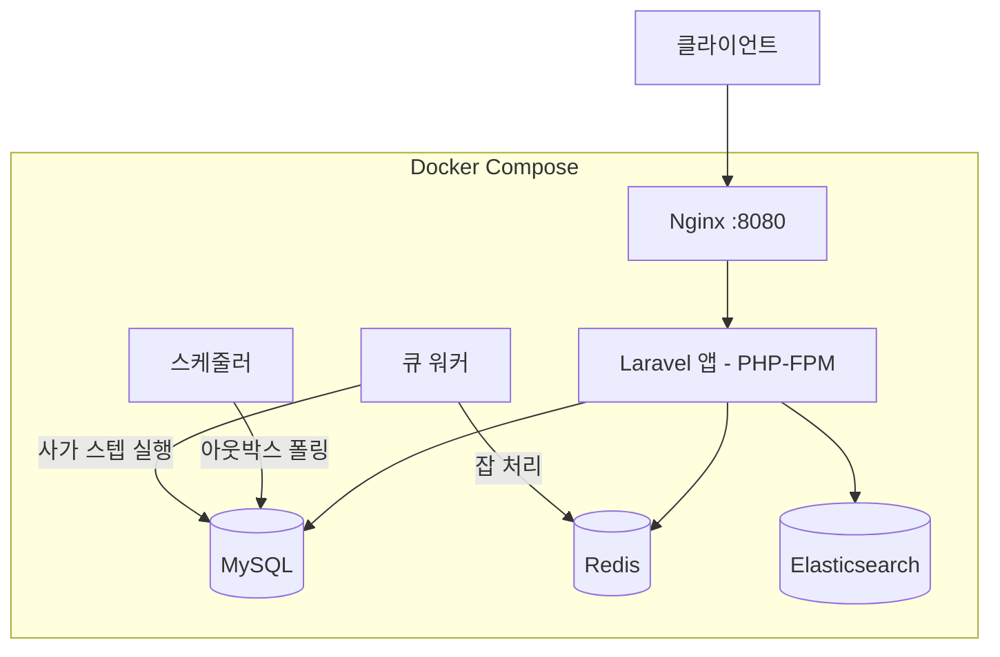
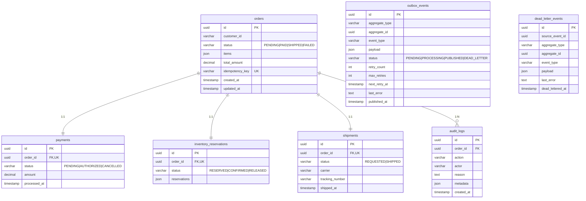

# Order Orchestrator (Laravel)

**Laravel** 기반의 이벤트 주도 주문 처리 시스템 — 이커머스 도메인에서의 Saga 패턴, Outbox 패턴, 운영 안정성을 시연합니다.

> 이 프로젝트는 [order-orchestrator (NestJS)](https://github.com/alswns612/order-orchestrator) 프로젝트의 핵심 아키텍처를 PHP/Laravel로 재구현한 것입니다.

## 기술 스택

| 분류 | 기술 | 버전 |
|------|------|------|
| 백엔드 | PHP / Laravel | 8.4 / 12.x |
| 데이터베이스 | MySQL | 8.0 |
| 캐시 & 큐 | Redis | 7.x |
| 검색 엔진 | Elasticsearch | 8.x |
| 웹서버 | Nginx | 1.27 |
| 인프라 | Docker Compose | - |
| 프론트엔드 | Vue 3 (예정) | - |

---

## 아키텍처



### 핵심 설계 패턴

#### 1. 주문 상태 머신 (Order State Machine)

허용된 상태 전이만 통과시키는 엄격한 상태 관리:

```
PENDING ──→ PAID ──→ SHIPPED    (정상 흐름)
   │          │
   └──→ FAILED ←──┘              (실패 흐름)
```

- `OrderStateMachine` 서비스가 모든 상태 전이를 검증
- 허용되지 않은 전이 시도 시 `InvalidArgumentException` 발생
- 관리자용 `forceStatus`로 상태 머신 우회 가능 (감사 로그 필수 기록)

#### 2. 사가 오케스트레이터 (Saga Orchestrator)

다단계 주문 처리를 순차 실행하고, 실패 시 **보상 트랜잭션**으로 역순 롤백:

```
[정상 흐름]
1. 결제 승인 (Payment: PENDING → AUTHORIZED)
2. 주문 상태 변경 (Order: PENDING → PAID)
3. 재고 확인 (InventoryReservation: RESERVED → CONFIRMED)
4. 배송 요청 (Shipment: REQUESTED → SHIPPED, 운송장 발급)
5. 주문 상태 변경 (Order: PAID → SHIPPED)

[보상 트랜잭션 — 3단계 실패 예시]
3. 재고 확인 실패 →
   ← 결제 취소 (Payment: AUTHORIZED → CANCELLED)
   ← 주문 실패 (Order → FAILED)
   ← 감사 로그 기록 (각 보상 단계별)
```

#### 3. 아웃박스 패턴 (Outbox Pattern)

주문 생성과 이벤트 발행의 원자성을 보장:

```
1. 단일 DB 트랜잭션:
   Order + Payment + InventoryReservation + Shipment + OutboxEvent(PENDING) 생성

2. OutboxProcessor가 주기적으로 PENDING 이벤트를 폴링:
   PENDING → PROCESSING → (성공) PUBLISHED
                        → (실패) 재시도 (지수 백오프)
                        → (재시도 초과) DEAD_LETTER

3. 지수 백오프: min(1000ms × 2^retryCount, 60000ms)
   기본 최대 재시도: 5회
```

#### 4. 데드 레터 큐 (DLQ)

재시도 횟수를 초과한 실패 이벤트를 별도 관리:
- `dead_letter_events` 테이블에 원본 이벤트 정보 + 마지막 에러 메시지 보존
- 관리자 API로 단건/배치 재처리 가능
- 이벤트 타입별 필터링 조회 지원

---

## 데이터베이스 스키마

### ERD



### 테이블 요약 (7개)

| 테이블 | 설명 | 주요 인덱스 |
|--------|------|------------|
| `orders` | 주문 정보 (상태, 상품 목록, 총 금액) | `customer_id`, `status`, `idempotency_key(UNIQUE)` |
| `payments` | 결제 상태 추적 | `order_id(UNIQUE, FK)` |
| `inventory_reservations` | 재고 예약 상태 | `order_id(UNIQUE, FK)` |
| `shipments` | 배송 정보 (운송사, 송장번호) | `order_id(UNIQUE, FK)` |
| `outbox_events` | 아웃박스 이벤트 큐 | `(status, next_retry_at)` 복합 인덱스 |
| `dead_letter_events` | 실패 이벤트 보관 | `source_event_id`, `event_type` |
| `audit_logs` | 주문 변경 이력 감사 | `order_id(FK)` |

### Enum 정의 (PHP Backed Enum)

| Enum | 값 |
|------|----|
| `OrderStatus` | `PENDING`, `PAID`, `SHIPPED`, `FAILED` |
| `PaymentStatus` | `PENDING`, `AUTHORIZED`, `CANCELLED` |
| `InventoryReservationStatus` | `RESERVED`, `CONFIRMED`, `RELEASED` |
| `ShipmentStatus` | `REQUESTED`, `SHIPPED` |
| `OutboxEventStatus` | `PENDING`, `PROCESSING`, `PUBLISHED`, `DEAD_LETTER` |

---

## API 엔드포인트

### 공개 API

| 메서드 | 엔드포인트 | 설명 | 비고 |
|--------|-----------|------|------|
| `POST` | `/api/v1/orders` | 주문 생성 | `Idempotency-Key` 헤더로 멱등성 보장 |
| `GET` | `/api/v1/orders/{id}` | 주문 상세 조회 | 결제/재고/배송 정보 eager load |
| `PATCH` | `/api/v1/orders/{id}/status` | 주문 상태 변경 | 상태 머신 검증 적용 |

### 관리자 API

| 메서드 | 엔드포인트 | 설명 |
|--------|-----------|------|
| `POST` | `/api/v1/admin/orders/{id}/reprocess` | 실패(FAILED) 주문을 PENDING으로 되돌리고 사가 재실행 |
| `POST` | `/api/v1/admin/orders/{id}/force-status` | 상태 머신을 우회하여 강제 변경 (사유 필수) |
| `GET` | `/api/v1/admin/orders/{id}/audit-logs` | 주문별 감사 로그 조회 (페이지네이션) |
| `GET` | `/api/v1/admin/outbox/pending` | PENDING 상태 아웃박스 이벤트 목록 |
| `POST` | `/api/v1/admin/outbox/dispatch` | 아웃박스 이벤트 수동 디스패치 |
| `GET` | `/api/v1/admin/outbox/dlq` | DLQ 이벤트 목록 (이벤트 타입 필터 가능) |
| `POST` | `/api/v1/admin/outbox/dlq/{id}/reprocess` | DLQ 이벤트 단건 재처리 |
| `POST` | `/api/v1/admin/outbox/dlq/reprocess` | DLQ 이벤트 배치 재처리 (IDs 또는 이벤트 타입) |

### 요청/응답 예시

<details>
<summary>주문 생성 (POST /api/v1/orders)</summary>

**요청:**
```bash
curl -X POST http://localhost:8080/api/v1/orders \
  -H "Content-Type: application/json" \
  -H "Idempotency-Key: order-20240101-001" \
  -d '{
    "customer_id": "CUST-001",
    "items": [
      {"product_id": "PROD-A", "name": "맥북 프로 14", "quantity": 1, "price": 2990000},
      {"product_id": "PROD-B", "name": "매직 마우스", "quantity": 2, "price": 129000}
    ]
  }'
```

**응답 (201 Created):**
```json
{
  "data": {
    "id": "019d4d45-8ffd-732f-ab1e-1f055b993e1f",
    "customer_id": "CUST-001",
    "status": "PENDING",
    "items": [
      {"product_id": "PROD-A", "name": "맥북 프로 14", "quantity": 1, "price": 2990000},
      {"product_id": "PROD-B", "name": "매직 마우스", "quantity": 2, "price": 129000}
    ],
    "total_amount": "3248000.00",
    "idempotency_key": "order-20240101-001",
    "payment": {"id": "...", "status": "PENDING", "amount": "3248000.00", "processed_at": null},
    "inventory_reservation": {"id": "...", "status": "RESERVED", "reservations": [...]},
    "shipment": {"id": "...", "status": "REQUESTED", "carrier": null, "tracking_number": null},
    "created_at": "2026-04-02T08:18:17+00:00",
    "updated_at": "2026-04-02T08:18:17+00:00"
  }
}
```
</details>

<details>
<summary>수동 디스패치 (POST /api/v1/admin/outbox/dispatch)</summary>

**요청:**
```bash
curl -X POST http://localhost:8080/api/v1/admin/outbox/dispatch \
  -H "Content-Type: application/json" \
  -d '{"limit": 5}'
```

**응답:**
```json
{
  "message": "디스패치 완료",
  "processed": 1,
  "published": 1,
  "failed": 0
}
```

디스패치 후 주문 상태가 `PENDING → PAID → SHIPPED`로 자동 전이됩니다.
</details>

---

## 프로젝트 구조

```
order-orchestrator-laravel/
├── app/
│   ├── Enums/                              # PHP Backed Enum
│   │   ├── OrderStatus.php                 #   PENDING, PAID, SHIPPED, FAILED
│   │   ├── PaymentStatus.php               #   PENDING, AUTHORIZED, CANCELLED
│   │   ├── InventoryReservationStatus.php  #   RESERVED, CONFIRMED, RELEASED
│   │   ├── ShipmentStatus.php              #   REQUESTED, SHIPPED
│   │   └── OutboxEventStatus.php           #   PENDING, PROCESSING, PUBLISHED, DEAD_LETTER
│   ├── Http/
│   │   ├── Controllers/
│   │   │   └── Api/V1/
│   │   │       ├── OrderController.php     # 주문 생성/조회/상태변경
│   │   │       └── Admin/
│   │   │           ├── AdminOrderController.php   # 재처리/강제변경/감사로그
│   │   │           └── OutboxAdminController.php  # 아웃박스/DLQ 관리
│   │   ├── Requests/Api/V1/               # Form Request (입력 유효성 검증)
│   │   │   ├── CreateOrderRequest.php
│   │   │   ├── UpdateOrderStatusRequest.php
│   │   │   ├── ForceOrderStatusRequest.php
│   │   │   ├── DispatchOutboxRequest.php
│   │   │   └── BatchReprocessDlqRequest.php
│   │   └── Resources/                     # API Resource (응답 포맷)
│   │       ├── OrderResource.php
│   │       ├── PaymentResource.php
│   │       ├── InventoryReservationResource.php
│   │       ├── ShipmentResource.php
│   │       ├── OutboxEventResource.php
│   │       ├── DeadLetterEventResource.php
│   │       └── AuditLogResource.php
│   ├── Models/                             # Eloquent 모델 (UUID PK, 관계 정의)
│   │   ├── Order.php                       #   → hasOne: Payment, InventoryReservation, Shipment
│   │   ├── Payment.php                     #   → belongsTo: Order
│   │   ├── InventoryReservation.php        #   → belongsTo: Order
│   │   ├── Shipment.php                    #   → belongsTo: Order
│   │   ├── OutboxEvent.php                 #   독립 (aggregate 참조)
│   │   ├── DeadLetterEvent.php             #   독립 (source_event_id 참조)
│   │   └── AuditLog.php                    #   → belongsTo: Order
│   └── Services/                           # 비즈니스 로직
│       ├── OrderService.php                # 주문 CRUD + 재처리 + DLQ 관리
│       ├── OrderStateMachine.php           # 상태 전이 규칙 검증
│       ├── SagaOrchestrator.php            # 결제→재고→배송 사가 + 보상 트랜잭션
│       ├── OutboxProcessor.php             # 이벤트 디스패치 + 재시도 + DLQ 이관
│       ├── OrderEventConsumer.php          # 이벤트 타입별 핸들러 라우팅
│       └── AuditLogService.php             # 감사 로그 기록
├── database/
│   └── migrations/                         # MySQL 마이그레이션 (7개 테이블)
├── routes/
│   └── api.php                             # API v1 라우트 정의 (13개 엔드포인트)
├── docker/
│   ├── php/Dockerfile                      # PHP 8.4-FPM + Redis 확장
│   ├── php/local.ini                       # PHP 설정
│   └── nginx/default.conf                  # Nginx 리버스 프록시
├── docker-compose.yml                      # 전체 인프라 (6개 서비스)
└── Makefile                                # 개발 편의 명령어
```

---

## 시작하기

### 사전 요구사항

- Docker & Docker Compose

### 설치

```bash
# 저장소 클론
git clone https://github.com/alswns612/order-orchestrator-laravel.git
cd order-orchestrator-laravel

# 최초 설치 (한 번만 실행)
make setup

# 또는 수동으로:
docker compose build
docker compose run --rm app composer install
docker compose run --rm app cp -n .env.example .env
docker compose run --rm app php artisan key:generate
docker compose up -d
docker compose exec app php artisan migrate
```

### 접속 정보

| 서비스 | URL |
|--------|-----|
| API | http://localhost:8080 |
| API 문서 (Swagger) | http://localhost:8080/api/documentation |
| MySQL | localhost:3306 (app_user / app_password) |
| Redis | localhost:6379 |
| Elasticsearch | localhost:9200 |

### 주요 명령어

```bash
make up          # 컨테이너 시작
make down        # 컨테이너 중지
make shell       # 앱 컨테이너 쉘 접속
make test        # 테스트 실행
make fresh       # 마이그레이션 초기화 + 시드
make logs        # 로그 확인
make mysql       # MySQL CLI 접속
make redis       # Redis CLI 접속
```

---

## Docker 구성

| 서비스 | 이미지 | 역할 | 포트 |
|--------|--------|------|------|
| `app` | PHP 8.4-FPM (커스텀) | Laravel 애플리케이션 | 9000 (내부) |
| `nginx` | nginx:1.27-alpine | 리버스 프록시 | 8080 |
| `mysql` | mysql:8.0 | 데이터베이스 | 3306 |
| `redis` | redis:7-alpine | 캐시, 세션, 큐 드라이버 | 6379 |
| `elasticsearch` | elasticsearch:8.15.0 | 검색 엔진 | 9200 |
| `queue-worker` | PHP 8.4-FPM (커스텀) | `php artisan queue:work redis` | - |
| `scheduler` | PHP 8.4-FPM (커스텀) | `php artisan schedule:run` (1분 주기) | - |

---

## 개발 진행 상황

- [x] **Phase 1** — 프로젝트 초기 설정 (Laravel 12, Docker Compose, MySQL/Redis/ES 연동)
- [x] **Phase 2** — 데이터베이스 스키마 (마이그레이션 7개, Enum 5종, Eloquent 모델 7개)
- [x] **Phase 3** — RESTful API + 핵심 비즈니스 로직 (13개 엔드포인트, 사가/아웃박스/DLQ)
- [ ] **Phase 4** — Saga + Outbox + Redis Queue 심화
- [ ] **Phase 5** — Redis 활용 (캐시, Rate Limiting, 실패 주입)
- [ ] **Phase 6** — Elasticsearch 주문 검색
- [ ] **Phase 7** — Vue 3 관리자 대시보드
- [ ] **Phase 8** — 테스트 + GitHub Actions CI

## 라이선스

MIT
