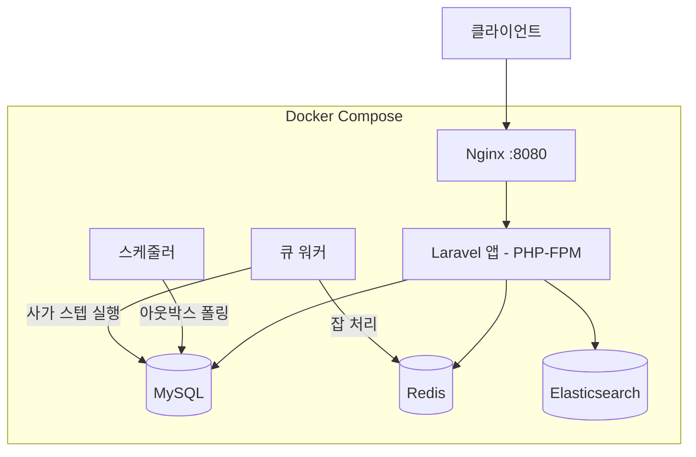

# Order Orchestrator (Laravel)

**Laravel** 기반의 이벤트 주도 주문 처리 시스템 — 이커머스 도메인에서의 Saga 패턴, Outbox 패턴, 운영 안정성을 시연합니다.

## 기술 스택

- **백엔드**: PHP 8.4 / Laravel 12
- **데이터베이스**: MySQL 8.0
- **캐시 & 큐**: Redis 7
- **검색**: Elasticsearch 8.x
- **인프라**: Docker Compose
- **프론트엔드**: Vue 3 (관리자 대시보드)

## 아키텍처



### 핵심 패턴

- **주문 상태 머신**: `PENDING → PAID → SHIPPED` 엄격한 상태 전이 검증
- **사가 오케스트레이터**: 다단계 주문 처리 + 실패 시 보상 트랜잭션
- **아웃박스 패턴**: 지수 백오프를 통한 안정적인 이벤트 발행
- **데드 레터 큐**: 실패 이벤트 관리 및 관리자 재처리

## 시작하기

### 사전 요구사항

- Docker & Docker Compose

### 설치

```bash
# 저장소 클론
git clone https://github.com/alswns612/order-orchestrator-laravel.git
cd order-orchestrator-laravel

# 최초 설치 (한 번만 실행)
make setup

# 또는 수동으로:
docker compose build
docker compose run --rm app composer install
docker compose run --rm app cp -n .env.example .env
docker compose run --rm app php artisan key:generate
docker compose up -d
docker compose exec app php artisan migrate
```

### 접속 정보

| 서비스           | URL                        |
|-----------------|----------------------------|
| API             | http://localhost:8080       |
| API 문서         | http://localhost:8080/api/documentation |
| MySQL           | localhost:3306              |
| Redis           | localhost:6379              |
| Elasticsearch   | localhost:9200              |

### 주요 명령어

```bash
make up          # 컨테이너 시작
make down        # 컨테이너 중지
make shell       # 앱 컨테이너 쉘 접속
make test        # 테스트 실행
make fresh       # 마이그레이션 초기화 + 시드
make logs        # 로그 확인
make mysql       # MySQL CLI 접속
make redis       # Redis CLI 접속
```

## API 엔드포인트

### 공개 API

| 메서드  | 엔드포인트                  | 설명               |
|--------|-------------------------|---------------------|
| POST   | /api/v1/orders          | 주문 생성            |
| GET    | /api/v1/orders/{id}     | 주문 상세 조회        |
| PATCH  | /api/v1/orders/{id}/status | 주문 상태 변경     |
| GET    | /api/v1/orders/search   | 주문 검색 (ES)       |

### 관리자 API

| 메서드  | 엔드포인트                               | 설명                |
|--------|----------------------------------------|---------------------|
| POST   | /api/v1/admin/orders/{id}/reprocess    | 실패 주문 재처리      |
| POST   | /api/v1/admin/orders/{id}/force-status | 상태 강제 변경        |
| GET    | /api/v1/admin/orders/{id}/audit-logs   | 감사 로그 조회        |
| GET    | /api/v1/admin/outbox/pending           | 대기 중인 이벤트 조회  |
| POST   | /api/v1/admin/outbox/dispatch          | 수동 디스패치         |
| GET    | /api/v1/admin/outbox/dlq              | DLQ 이벤트 조회       |
| POST   | /api/v1/admin/outbox/dlq/{id}/reprocess | DLQ 이벤트 재처리   |

## 프로젝트 구조

```
app/
├── Http/
│   ├── Controllers/
│   │   └── Api/V1/
│   │       ├── OrderController.php
│   │       └── Admin/
│   │           ├── AdminOrderController.php
│   │           └── OutboxAdminController.php
│   ├── Requests/          # 폼 유효성 검증
│   └── Resources/         # API 응답 포맷
├── Models/                # Eloquent 모델
├── Services/              # 비즈니스 로직
│   ├── OrderStateMachine.php
│   ├── SagaOrchestrator.php
│   ├── OutboxProcessor.php
│   └── ElasticsearchService.php
├── Enums/                 # OrderStatus, PaymentStatus 등
├── Events/                # 도메인 이벤트
└── Jobs/                  # 큐 잡
```

## 라이선스

MIT
