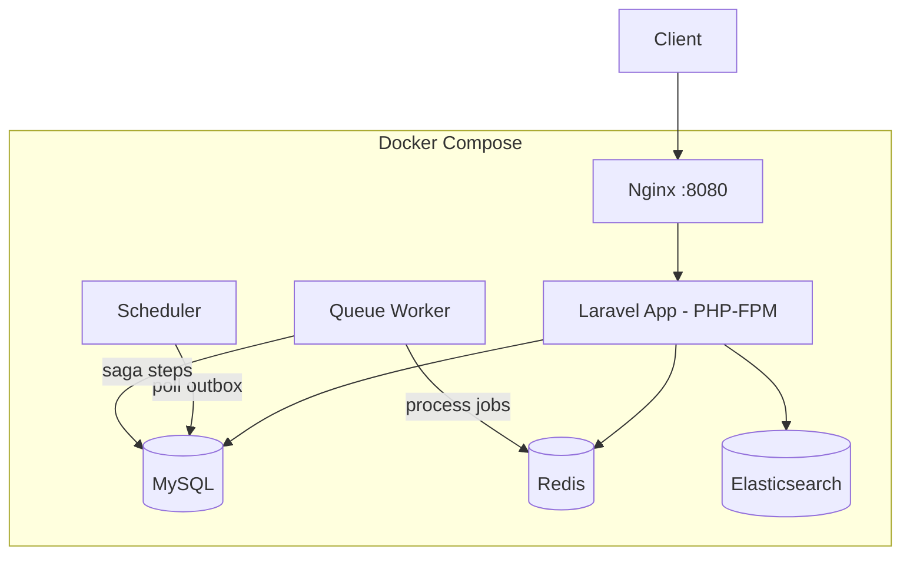

# Order Orchestrator (Laravel)

Event-driven order processing system built with **Laravel** — demonstrating Saga pattern, Outbox pattern, and comprehensive operational reliability for e-commerce domains.

## Tech Stack

- **Backend**: PHP 8.3 / Laravel 12
- **Database**: MySQL 8.0
- **Cache & Queue**: Redis 7
- **Search**: Elasticsearch 8.x
- **Infrastructure**: Docker Compose
- **Frontend**: Vue 3 (Admin Dashboard)

## Architecture



### Core Patterns

- **Order State Machine**: `PENDING → PAID → SHIPPED` with strict transition validation
- **Saga Orchestrator**: Multi-step order fulfillment with compensating transactions on failure
- **Outbox Pattern**: Reliable event publishing with retry + exponential backoff
- **Dead Letter Queue**: Failed events management with admin reprocessing

## Getting Started

### Prerequisites

- Docker & Docker Compose

### Setup

```bash
# Clone the repository
git clone https://github.com/your-username/order-orchestrator-laravel.git
cd order-orchestrator-laravel

# Start everything (first time)
make setup

# Or manually:
docker compose build
docker compose run --rm app composer install
docker compose run --rm app cp -n .env.example .env
docker compose run --rm app php artisan key:generate
docker compose up -d
docker compose exec app php artisan migrate
```

### Access

| Service         | URL                        |
|-----------------|----------------------------|
| API             | http://localhost:8080       |
| API Docs        | http://localhost:8080/api/documentation |
| MySQL           | localhost:3306              |
| Redis           | localhost:6379              |
| Elasticsearch   | localhost:9200              |

### Useful Commands

```bash
make up          # Start containers
make down        # Stop containers
make shell       # Shell into app container
make test        # Run tests
make fresh       # Fresh migration + seed
make logs        # View logs
make mysql       # MySQL CLI
make redis       # Redis CLI
```

## API Endpoints

### Public

| Method | Endpoint                | Description               |
|--------|-------------------------|---------------------------|
| POST   | /api/v1/orders          | Create order              |
| GET    | /api/v1/orders/{id}     | Get order details         |
| PATCH  | /api/v1/orders/{id}/status | Update order status    |
| GET    | /api/v1/orders/search   | Search orders (ES)        |

### Admin

| Method | Endpoint                          | Description                |
|--------|-----------------------------------|----------------------------|
| POST   | /api/v1/admin/orders/{id}/reprocess | Reprocess failed order   |
| POST   | /api/v1/admin/orders/{id}/force-status | Force status change   |
| GET    | /api/v1/admin/orders/{id}/audit-logs | Get audit trail         |
| GET    | /api/v1/admin/outbox/pending      | List pending events        |
| POST   | /api/v1/admin/outbox/dispatch     | Manual dispatch            |
| GET    | /api/v1/admin/outbox/dlq          | List DLQ events            |
| POST   | /api/v1/admin/outbox/dlq/{id}/reprocess | Reprocess DLQ event |

## Project Structure

```
app/
├── Http/
│   ├── Controllers/
│   │   └── Api/V1/
│   │       ├── OrderController.php
│   │       └── Admin/
│   │           ├── AdminOrderController.php
│   │           └── OutboxAdminController.php
│   ├── Requests/          # Form validation
│   └── Resources/         # API response formatting
├── Models/                # Eloquent models
├── Services/              # Business logic
│   ├── OrderStateMachine.php
│   ├── SagaOrchestrator.php
│   ├── OutboxProcessor.php
│   └── ElasticsearchService.php
├── Enums/                 # OrderStatus, PaymentStatus, etc.
├── Events/                # Domain events
└── Jobs/                  # Queue jobs
```

## License

MIT
